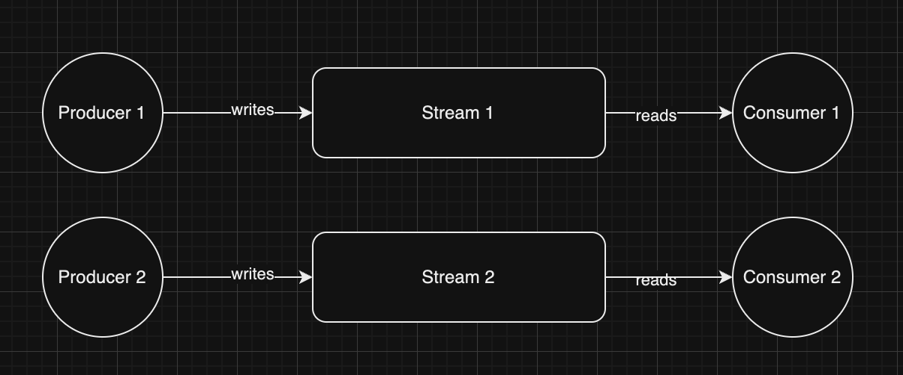
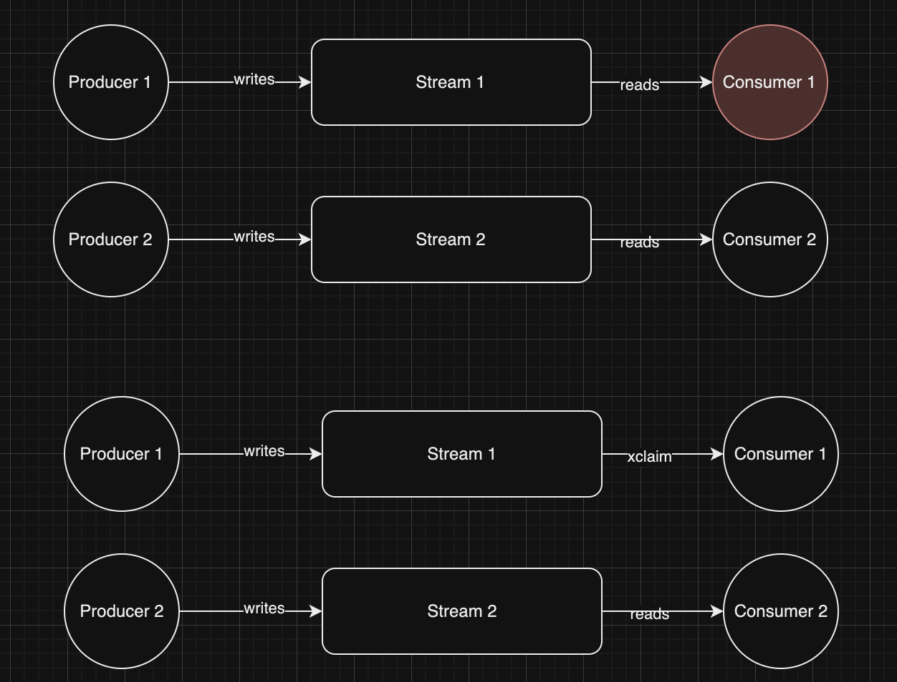
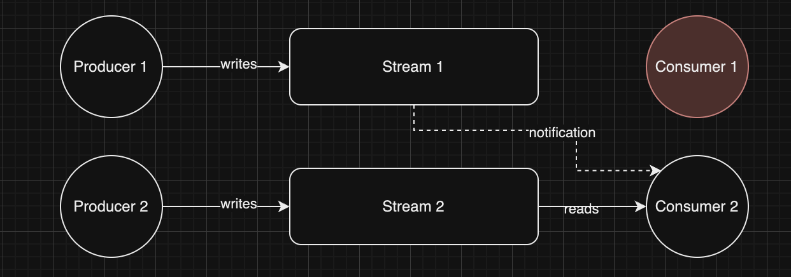
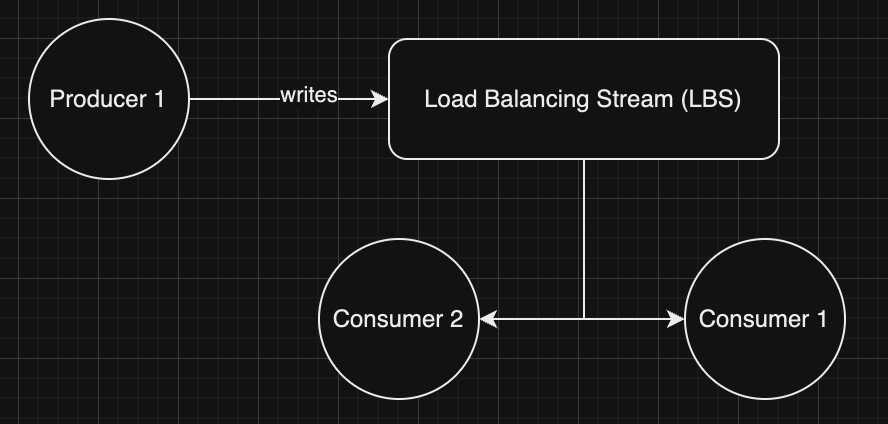

# redis-stream-client-go

[](https://github.com/badari31/redis-stream-client-go/actions/workflows/go.yml)

A redis stream based client that can recover from failures. This lib is based on [go-redis](https://github.com/redis/go-redis) and [redsync](https://github.com/go-redsync/redsync)

Redis streams are awesome! Typically they are used for data written in one end and consumed at other.



When one (or more) of the consumers fail (crash, get stuck for abnormal period of time), the way to recover is by using XCLAIM (and XAUTOCLAIM) per redis streams. This supposes that your consumers are stateful i.e. they know who they are via a dedicated machine name or IP. This way using XPENDING and XCLAIM you can recover from failed or stuck situations.



However, there are two requirements that it doesn't meet:
1. Recovery depends on how soon the crashed consumer can come back up and claim. This is normally a small time (few seconds) but sometimes it can be high due to startup logic.
2. When a consumer gets stuck (GC or some such stop-the-world process) then the processing is stuck.

In both situations above, there are other consumers waiting and perhaps availble who can claim and continue processing in real-time. However, due to redis' pull based mechanism they don't know if they need to.

This library aims to provide two such constructs built on top of redis' own data structures:
1. Inform other consumers that a consumer is dead or stuck via key space notifications.
2. Provide API to claim the stream being processed.



In addition to this, for better management, the library provides a load balancer stream (LBS) based on redis streams and consumer groups that work in a load balanced fashion which can distribute incoming streams (not stream data!) among existing consumers using round-robin fashion.



# usage

Just import the library:

```
go get https://github.com/badari31/redis-stream-client-go
```

Create the client:

```
import rsc "github.com/badari31/redis-stream-client-go/impl"
```

```
client := rsc.NewRedisStreamClient(<go redis client>, <heartbeat_interval>, <service_name>)
```

Initialize the client and use the LBC and Key space notification channel for tracking which data streams to read and which have expired respectively:

```
lbsChan, kspChan, err := client.Init(ctx)
```

When a notification is received on `kspChan`, then client calls `Claim` to claim the datastream name:

```
err := client.Claim(ctx, <ksp notification payload>)
```

An error in `Claim` indicates the client was not successful in claiming the stream as some other client got there before.

After all the processing is done, call `DoneDataStream` on client to mark end for a particular data stream that the consumer owns (full list can be obtained by `StreamsOwned()`)

```
client.DoneDataStream(ctx, <data stream name>)
```

Or if the client wants to release all streams and mark them as done (for whatever reason): use `Done(ctx)`

```
client.Done(ctx)
```

Method `ID()` can be used to obtain client ID for logging purposes:

```
client.ID()
```