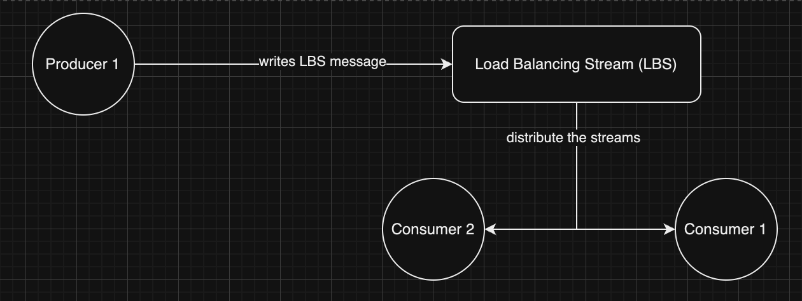

# redis-stream-client-go

[](https://github.com/handcoding-labs/redis-stream-client-go/actions/workflows/go.yml) [](https://scorecard.dev/viewer/?uri=github.com/handcoding-labs/redis-stream-client-go)

A Redis stream-based client with automatic failure recovery. Built on [go-redis](https://github.com/redis/go-redis) and [redsync](https://github.com/go-redsync/redsync).

## Problem

Standard Redis stream recovery via XCLAIM requires:
1. Crashed consumer to come back up and reclaim
2. Stuck consumers (GC pauses) block processing

Other available consumers can't help because Redis is pull-based—they don't know recovery is needed.

## Solution

This library provides:
1. **Keyspace notifications** - Inform other consumers when a consumer dies or gets stuck
2. **Claim API** - Allow any consumer to claim orphaned streams
3. **Load Balancer Stream (LBS)** - Distribute streams across consumers via round-robin



## Quick Start

```go
client, _ := impl.NewRedisStreamClient(redisClient, "my-service")
outputChan, _ := client.Init(ctx)

for notification := range outputChan {
    switch notification.Type {
    case notifs.StreamAdded:
        go process(notification.Payload.DataStreamName)
    case notifs.StreamExpired:
        client.Claim(ctx, notification.Payload)
# Architecture

## Threading Model

The library spawns multiple goroutines to handle concurrent operations:

```
┌─────────────────────────────────────────────────────────────────┐
│                         Client Instance                          │
├─────────────────────────────────────────────────────────────────┤
│                                                                  │
│  ┌─────────────────┐                                            │
│  │ LBS Reader      │  1 goroutine - reads from Load Balancer    │
│  │ (blocking read) │  Stream, assigns streams to this consumer  │
│  └─────────────────┘                                            │
│                                                                  │
│  ┌─────────────────┐                                            │
│  │ Keyspace        │  1 goroutine - listens for Redis key       │
│  │ Listener        │  expiration events (pub/sub)               │
│  └─────────────────┘                                            │
│                                                                  │
│  ┌─────────────────┐                                            │
│  │ Key Extender    │  N goroutines - one per active stream      │
│  │ (stream-1)      │  extends distributed lock every hbInterval │
│  ├─────────────────┤                                            │
│  │ Key Extender    │  Goroutines exit when:                     │
│  │ (stream-2)      │  - DoneStream() called                     │
│  ├─────────────────┤  - Lock extension fails                    │
│  │ Key Extender    │  - Context cancelled                       │
│  │ (stream-N)      │                                            │
│  └─────────────────┘                                            │
│                                                                  │
│  ┌─────────────────┐                                            │
│  │ Notification    │  1 goroutine - serializes all              │
│  │ Broker          │  notifications to output channel           │
│  └─────────────────┘                                            │
│                                                                  │
└─────────────────────────────────────────────────────────────────┘

Total goroutines per client: 3 + N (where N = active streams)
```

**Key points:**
- Each active stream has its own key extender goroutine
- Goroutines are lightweight (~2KB stack) but scale with stream count
- All goroutines are properly cleaned up on `Done()` or context cancellation

## NotificationBroker

The library uses an internal `NotificationBroker` component to safely manage notifications from multiple concurrent sources. This ensures thread-safe delivery to the output channel and prevents panics during shutdown.

```
┌─────────────────────┐     ┌─────────────────────┐
│  Key Extenders      │────▶│                     │
│  (one per stream)   │     │                     │
└─────────────────────┘     │                     │
                            │  NotificationBroker │────▶ outputChan
┌─────────────────────┐     │                     │
│  Keyspace Listener  │────▶│  - Thread-safe      │
│  (Redis pub/sub)    │     │  - Graceful shutdown│
└─────────────────────┘     │  - No send panics   │
                            │                     │
┌─────────────────────┐     │                     │
│  LBS Stream Reader  │────▶│                     │
└─────────────────────┘     └─────────────────────┘
```

## Backpressure & Slow Consumers

When your consumer processes messages slower than they arrive:

### What happens internally

1. **Output channel fills up** - The output channel has a buffer (default: 500 notifications)
2. **Broker blocks** - Once full, the NotificationBroker blocks waiting for space
3. **Upstream backs up** - LBS reader, keyspace listener, and key extenders block on broker
4. **Redis consumer lag increases** - Messages accumulate in Redis pending entries list (PEL)

### Symptoms of slow consumption

- Growing `XPENDING` count in Redis
- Increased memory usage in Redis
- Notifications arriving late (stream expirations delayed)
- Potential message recovery by other consumers if idle time exceeded

### Mitigation strategies

```go
// 1. Process notifications concurrently
for notification := range outputChan {
    go handleNotification(notification)  // Don't block the reader
}

// 2. Use worker pool for controlled concurrency
workerPool := make(chan struct{}, 10)  // 10 concurrent workers
for notification := range outputChan {
    workerPool <- struct{}{}
    go func(n notifs.RecoverableRedisNotification) {
        defer func() { <-workerPool }()
        handleNotification(n)
    }(notification)
}

// 3. Acknowledge streams promptly
// Call DoneStream() as soon as processing completes
client.DoneStream(ctx, streamName)
```

### Monitoring backpressure

```bash
# Check pending messages per consumer
redis-cli XPENDING my-service-input my-service-group

# Check consumer lag
redis-cli XINFO CONSUMERS my-service-input my-service-group
```

## Memory Implications

### Buffered Channels

| Channel | Default Size | Memory per Item | Purpose |
|---------|--------------|-----------------|---------|
| Output channel | 500 | ~200 bytes | Notifications to consumer |
| Broker input | 500 | ~200 bytes | Internal broker queue |
| Keyspace channel | 100 | ~100 bytes | Redis pub/sub messages |

**Approximate memory per client:** ~250KB for channels alone

### Per-Stream Memory

Each active stream consumes:
- **Goroutine stack:** ~2KB (grows as needed)
- **Mutex state:** ~200 bytes (redsync mutex)
- **StreamLocksInfo:** ~150 bytes (LBSInfo + metadata)

**Formula:** `Total = Base(250KB) + Streams × 2.5KB`

| Active Streams | Approximate Memory |
|----------------|-------------------|
| 10 | ~275 KB |
| 100 | ~500 KB |
| 1,000 | ~2.75 MB |
| 10,000 | ~25 MB |

### Redis Memory

The library creates Redis keys that consume memory:

- **Mutex keys:** One per active stream, expires after `hbInterval`
- **LBS stream:** Grows until messages are acknowledged
- **Consumer group metadata:** Small, fixed overhead

### Memory Management Best Practices

```go
// 1. Call DoneStream() promptly to release resources
if err := client.DoneStream(ctx, streamName); err != nil {
    slog.Error("Failed to release stream", "error", err)
}

// 2. Monitor active stream count
// High stream counts = high memory + goroutine usage

// 3. Tune channel sizes if needed (advanced)
client, err := impl.NewRedisStreamClient(
    redisClient,
    "my-service",
    impl.WithKspChanSize(50),  // Reduce if memory constrained
)

// 4. Implement circuit breaker for runaway stream counts
const maxStreams = 1000
if activeStreamCount > maxStreams {
    slog.Warn("Too many active streams, rejecting new assignments")
    // Handle gracefully
}
```

# usage

Just import the library:

```
go get https://github.com/handcoding-labs/redis-stream-client-go
```

Create the client:

```
import rsc "github.com/handcoding-labs/redis-stream-client-go/impl"
```

```
client := rsc.NewRedisStreamClient(<go redis client>, <service_name>)
```

## Configuration Options

The client supports optional configuration parameters:

```go
import "github.com/handcoding-labs/redis-stream-client-go/impl"

// Create client with custom configuration
client, err := impl.NewRedisStreamClient(
    redisClient, 
    "my-service",
    impl.WithLBSIdleTime(30*time.Second),        // Time before message considered idle (default: 40s)
    impl.WithLBSRecoveryCount(500),              // Number of messages to recover at once (default: 1000)
)
```

### Available Options:

- **`WithLBSIdleTime(duration)`**: Sets the time after which a message is considered idle and will be recovered by other consumers. Must be greater than 2 × heartbeat interval (4s minimum).
- **`WithLBSRecoveryCount(count)`**: Sets the number of messages to fetch at a time during recovery operations.

## Environment Variables

The client requires one of the following environment variables to generate unique consumer IDs:

- **`POD_NAME`**: Kubernetes pod name (preferred in containerized environments)
- **`POD_IP`**: Pod IP address (fallback option)

```bash
# Example setup
export POD_NAME=my-consumer-$(hostname)-$(date +%s)
# OR
export POD_IP=$(hostname -I | awk '{print $1}')
```

The consumer ID will be prefixed with `redis-consumer-` automatically.

Initialize the client and use the LBC and Key space notification channel for tracking which data streams to read and which have expired respectively:

```
outputChan, err := client.Init(ctx)
```

## Adding Messages to LBS

To add messages to the Load Balancer Stream (LBS), use the `LBSInputMessage` structure:

```go
import "github.com/handcoding-labs/redis-stream-client-go/notifs"

// Create an LBS message
lbsMessage := notifs.LBSInputMessage{
    DataStreamName: "user-session-123",
    Info: map[string]interface{}{
        "user_id":    "user-456",
        "session_id": "session-789",
        "priority":   "high",
        "created_at": time.Now().Format(time.RFC3339),
    },
}

// Marshal to JSON
messageData, err := json.Marshal(lbsMessage)
if err != nil {
    return err
}

// Add to LBS stream
result := redisClient.XAdd(ctx, &redis.XAddArgs{
    Stream: "<service_name>-input", // LBS stream name
    Values: map[string]interface{}{
        "lbs-input": string(messageData),
    },
})
```

The `Info` field in `LBSInputMessage` allows you to pass additional metadata that will be available in the notification's `AdditionalInfo` field when the stream is assigned to a consumer.

## Notification Types

There are currently four types of notifications sent on `outputChan`:
1. `StreamAdded` - When a new stream gets added to LBS. You should take the stream and start reading your data from it using standard `XREAD` or `XREADGROUP` commands as applicable. The notification includes:
   - `Payload`: Contains `DataStreamName` and `IDInLBS`
   - `AdditionalInfo`: Contains the `Info` field from the original `LBSInputMessage`
2. `StreamExpired` - When a client's ownership of stream expires and it relinquishes the lock. This is sent when key space notification arrives on stream expiry. Other clients should process this and take ownership of the stream by using `Claim` API.
3. `StreamDisowned` - When a client gets stuck (not crashed) and thus automatically relinquishes ownership, another active client will claim it. When the old client comes back, it will fail to extend the lock and thus will be informed that it now doesn't own the stream. The old client should gracefully exit by calling `Done` API.
4. `StreamTerminated` - Internal notification indicating the notification channel is closing, typically due to context cancellation or fatal errors. Contains additional info about the termination reason.

# claiming

When you receive a `StreamExpired` notification, you can claim the expired stream using the LBSInfo from the notification payload:

```go
case notifs.StreamExpired:
    if err := client.Claim(ctx, notification.Payload); err != nil {
        // Handle claim failure - another consumer may have claimed it first
        slog.Warn("Failed to claim expired stream", "error", err, "stream", notification.Payload.DataStreamName)
    } else {
        slog.Info("Successfully claimed expired stream", "stream", notification.Payload.DataStreamName)
        // Process the claimed stream
        go handleClaimedStream(ctx, notification.Payload.DataStreamName)
    }
```

An error in `Claim` indicates the client was not successful in claiming the stream as some other client got there before.

# stream lifecycle management

The library provides granular control over stream lifecycle:

## processing individual streams

After processing is done for a specific data stream, call `DoneStream` to mark the end of processing for that particular stream:

```
err := client.DoneStream(ctx, <data_stream_name>)
```

This method:
- Unlocks the distributed lock for the stream
- Acknowledges the message in the LBS stream
- Cleans up internal state for that specific stream

## client shutdown

When the client is shutting down completely, call `Done` to clean up all streams handled by the client:

```
err := client.Done()
```

This method calls `DoneStream` for all active streams and then performs additional cleanup like closing channels and canceling contexts. The internal `NotificationBroker` ensures all pending notifications are drained before the output channel is closed.

Method `ID()` can be used to obtain client ID for logging purposes:

```
client.ID()
```

# Complete Example

Here's a complete working example:

```go
package main

import (
    "context"
    "encoding/json"
    "log/slog"
    "os"
    "os/signal"
    "syscall"
    "time"

    "github.com/redis/go-redis/v9"
    "github.com/handcoding-labs/redis-stream-client-go/impl"
    "github.com/handcoding-labs/redis-stream-client-go/notifs"
    "github.com/handcoding-labs/redis-stream-client-go/types"
)

func main() {
    ctx, cancel := context.WithCancel(context.Background())
    defer cancel()

    // Set required environment variable
    os.Setenv("POD_NAME", "example-consumer")

    // Create Redis client
    redisClient := redis.NewUniversalClient(&redis.UniversalOptions{
        Addrs: []string{"localhost:6379"},
        DB:    0,
    })
    defer redisClient.Close()

    // Enable keyspace notifications
    redisClient.ConfigSet(ctx, "notify-keyspace-events", "Ex")

    // Create and initialize stream client
    client, err := impl.NewRedisStreamClient(redisClient, "example-service")
    if err != nil {
        slog.Error("could not initialize", "error", err.Error())
    }
    outputChan, err := client.Init(ctx)
    if err != nil {
        slog.Error("Failed to initialize client", "error", err)
        return
    }

    // Handle graceful shutdown
    sigChan := make(chan os.Signal, 1)
    signal.Notify(sigChan, syscall.SIGINT, syscall.SIGTERM)

    // Process notifications
    go func() {
        for notification := range outputChan {
            switch notification.Type {
            case notifs.StreamAdded:
                slog.Info("New stream assigned", "stream", notification.Payload.DataStreamName)
                // Process the stream and call DoneStream when finished
                go processStream(ctx, client, notification)

            case notifs.StreamExpired:
                if err := client.Claim(ctx, notification.Payload); err != nil {
                    slog.Warn("Failed to claim stream", "error", err)
                } else {
                    slog.Info("Claimed expired stream", "stream", notification.Payload.DataStreamName)
                    go processStream(ctx, client, notification)
                }

            case notifs.StreamDisowned:
                slog.Warn("Lost stream ownership", "stream", notification.Payload.DataStreamName)
            
            case notifs.StreamTerminated:
                slog.Info("Notification channel closing", "reason", notification.AdditionalInfo["info"])
            }
        }
    }()

    // Add test message to LBS
    go addTestMessage(ctx, redisClient)

    // Wait for shutdown
    <-sigChan
    client.Done()
}

func processStream(ctx context.Context, client types.RedisStreamClient, notification notifs.RecoverableRedisNotification) {
    streamName := notification.Payload.DataStreamName
    slog.Info("Processing stream", "stream", streamName, "info", notification.AdditionalInfo)
    
    // Simulate processing
    time.Sleep(2 * time.Second)
    
    // Mark stream as done
    if err := client.DoneStream(ctx, streamName); err != nil {
        slog.Error("Failed to mark stream done", "error", err, "stream", streamName)
    } else {
        slog.Info("Stream processing completed", "stream", streamName)
    }
}

func addTestMessage(ctx context.Context, redisClient redis.UniversalClient) {
    time.Sleep(1 * time.Second) // Wait for client to be ready
    
    lbsMessage := notifs.LBSInputMessage{
        DataStreamName: "test-stream-1",
        Info: map[string]interface{}{
            "priority": "high",
            "user_id":  "user-123",
        },
    }
}
```

## Documentation

| Document | Description |
|----------|-------------|
| [Architecture](./docs/ARCHITECTURE.md) | Threading model, NotificationBroker, internal design |
| [Usage Guide](./docs/USAGE.md) | API reference, configuration, notification types |
| [Operations](./docs/OPERATIONS.md) | Memory, limits, backpressure, troubleshooting |
| [Example](./docs/EXAMPLE.md) | Complete working example |

## Installation

```bash
go get github.com/handcoding-labs/redis-stream-client-go
```

## Requirements

- Go 1.21+
- Redis 6.0+ with keyspace notifications enabled (`notify-keyspace-events Ex`)
- Environment variable: `POD_NAME` or `POD_IP`

## License

LGPL-2.1

**Solutions**:
- Implement timeouts in your processing logic
- Use context cancellation for graceful shutdowns
- Monitor processing times and adjust `WithLBSIdleTime` if needed

### Output channel closed unexpectedly
**Cause**: The internal `NotificationBroker` detected a shutdown condition.
**Solution**: Check for `StreamTerminated` notifications which contain the reason for closure in `AdditionalInfo["info"]`. Common reasons include context cancellation or Redis connection errors.
