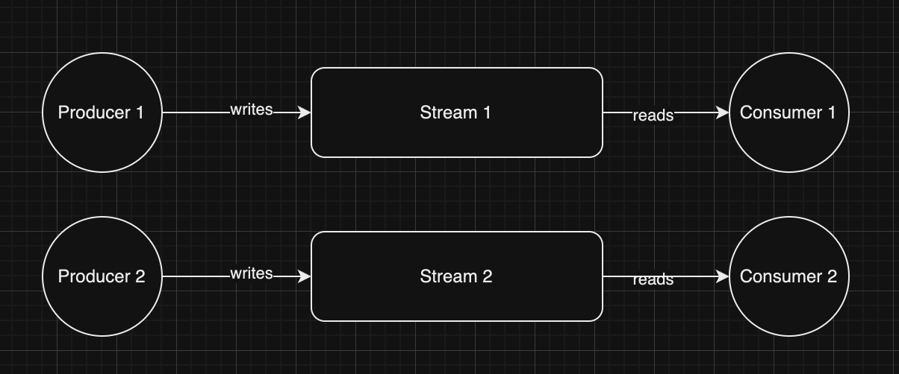
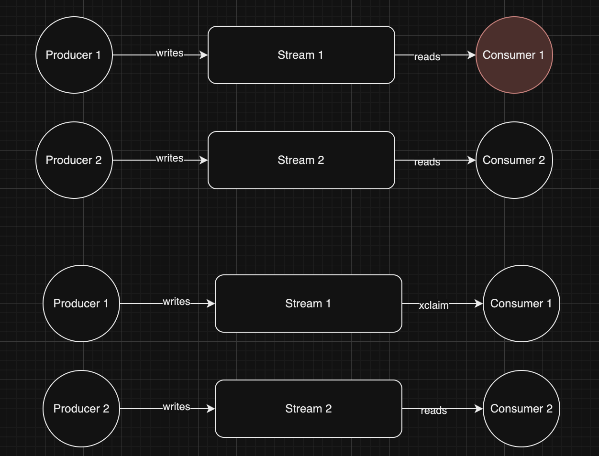
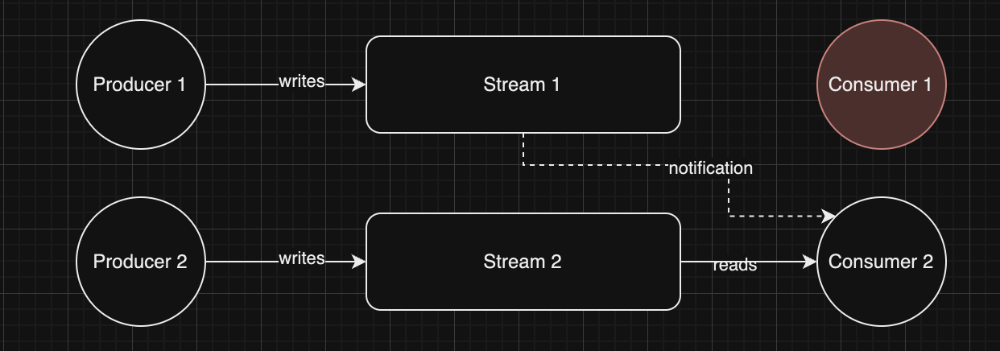
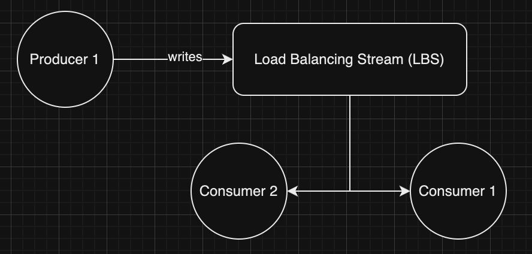

# Architecture

## Concept

Redis streams are typically used for data written at one end and consumed at the other.



When consumers fail (crash or get stuck), recovery uses XCLAIM/XAUTOCLAIM. This requires stateful consumers that know their identity via machine name or IP.



**Limitations:**
1. Recovery depends on crashed consumer restarting quickly
2. Stuck consumers (GC, stop-the-world) block processing indefinitely

This library solves both by:
1. A **periodic reconciliation scan** that recovers a dead consumer's work by re-queuing it
   (`XACK` + `XADD`) — but only after confirming the owner's distributed lock has actually expired,
   so a slow-but-alive consumer is never disturbed.
2. **Keyspace notifications** as a low-latency fast path: a lock expiry surfaces as a `StreamExpired`
   notification, and `Claim` re-queues the orphaned stream for redistribution.



### Recovery model

Recovery is **cluster-safe** and **at-least-once**:

- The scan reads the LBS consumer group's pending entries (`XPENDING`) and, for each entry idle
  longer than `MinIdleTime`, checks whether the owner's lock key still exists (`EXISTS`):
  - **lock present** → owner alive (just slow) → leave it untouched (prevents duplicate processing);
  - **lock absent** → owner dead → recover it.
- Recovery acknowledges the original pending message and re-adds it as a new message
  (`XACK` then `XADD`). The `XACK` happens first, so when several consumers race to recover the same
  message, only one wins and re-queues it.
- Each re-queue increments a `_retry_count` field. Once it exceeds `MaxRetries`, the message is routed
  to the configured `DLQStream` (or dropped if none is set).
- Startup recovery is simply the first pass of this scan (it replaced the old `XAUTOCLAIM` startup
  recovery).

### Cluster modes

- `ClusterModeSingleShard` (default): keyspace notifications are subscribed on the connected node;
  suitable for single-node, primary/replica, and Sentinel deployments.
- `ClusterModeOSS`: requires a `*redis.ClusterClient`. Keyspace notifications fire only on the master
  owning the expiring key, so the client enables notifications and subscribes on **every master**;
  the reconciliation scan is the authoritative recovery mechanism. `ResetTopology(ctx)` reloads the
  cluster view and rebuilds subscriptions after a failover or resharding.

> The scan uses `XPENDING ... IDLE`, which requires **Redis 6.2+**.

## Load Balancer Stream (LBS)

The LBS distributes incoming streams (not stream data) among consumers using Redis consumer groups with round-robin delivery.



## Threading Model

The library spawns multiple goroutines per client:

```
┌─────────────────────────────────────────────────────────────────┐
│                         Client Instance                          │
├─────────────────────────────────────────────────────────────────┤
│                                                                  │
│  ┌─────────────────┐                                            │
│  │ LBS Reader      │  1 goroutine - reads from Load Balancer    │
│  │ (blocking read) │  Stream, assigns streams to this consumer  │
│  └─────────────────┘                                            │
│                                                                  │
│  ┌─────────────────┐                                            │
│  │ Keyspace        │  1 goroutine - listens for Redis key       │
│  │ Listener        │  expiration events (pub/sub). In OSS mode  │
│  └─────────────────┘  one per master, fanned into one channel.  │
│                                                                  │
│  ┌─────────────────┐                                            │
│  │ Reconciliation  │  1 goroutine - periodic XPENDING scan that │
│  │ Scanner         │  re-queues dead consumers' work (jittered) │
│  └─────────────────┘                                            │
│                                                                  │
│  ┌─────────────────┐                                            │
│  │ Key Extender    │  N goroutines - one per active stream      │
│  │ (stream-1)      │  extends distributed lock every hbInterval │
│  ├─────────────────┤                                            │
│  │ Key Extender    │  Goroutines exit when:                     │
│  │ (stream-2)      │  - DoneStream() called                     │
│  ├─────────────────┤  - Lock extension fails                    │
│  │ Key Extender    │  - Context cancelled                       │
│  │ (stream-N)      │                                            │
│  └─────────────────┘                                            │
│                                                                  │
│  ┌─────────────────┐                                            │
│  │ Notification    │  1 goroutine - serializes all              │
│  │ Broker          │  notifications to output channel           │
│  └─────────────────┘                                            │
│                                                                  │
└─────────────────────────────────────────────────────────────────┘

Total goroutines per client: 4 + N (where N = active streams; +1 more per extra master in OSS mode)
```

**Key points:**
- Each active stream has its own key extender goroutine
- Goroutines are lightweight (~2KB stack) but scale with stream count
- All goroutines are properly cleaned up on `Done()` or context cancellation

## NotificationBroker

The library uses an internal `NotificationBroker` to safely manage notifications from multiple concurrent sources. This ensures thread-safe delivery to the output channel and prevents panics during shutdown.

```
┌─────────────────────┐     ┌─────────────────────┐
│  Key Extenders      │────▶│                     │
│  (one per stream)   │     │                     │
└─────────────────────┘     │                     │
                            │  NotificationBroker │────▶ outputChan
┌─────────────────────┐     │                     │
│  Keyspace Listener  │────▶│  - Thread-safe      │
│  (Redis pub/sub)    │     │  - Graceful shutdown│
└─────────────────────┘     │  - No send panics   │
                            │                     │
┌─────────────────────┐     │                     │
│  LBS Stream Reader  │────▶│                     │
└─────────────────────┘     └─────────────────────┘
```

### Shutdown Sequence

1. `Close()` sets closed flag and closes quit channel
2. `run()` goroutine exits select, drains remaining input messages
3. `Wait()` blocks until `run()` completes
4. Safe to close output channel—no more writers

## Redis Keys Created

| Key Pattern | Purpose | TTL |
|-------------|---------|-----|
| `<service>-input` | LBS stream | Persistent |
| `<service>-group` | Consumer group | Persistent |
| `<stream><MUTEX_KEY_SEP><id>` | Distributed lock per claimed stream | `hbInterval` |
| `<DLQStream>` | Optional dead-letter stream for messages exceeding `MaxRetries` | Persistent |

Re-queued LBS messages carry an extra `_retry_count` field; DLQ entries additionally carry `_dlq_reason`.

## Design Decisions

- **Metrics instrumentation**: the library exposes a `metrics.Recorder` interface so consumers can
  plug in any monitoring system (Prometheus example is provided).  This lets you track
  recovery latency, lock contention, stream processing times, and keyspace notifications.


**Why one goroutine per stream for lock extension?**
- Simplicity: each stream is independent
- Fault isolation: one stuck stream doesn't affect others
- Scales fine to ~1000 streams per client

**Why NotificationBroker instead of direct channel sends?**
- Multiple writers to single output channel
- Graceful shutdown without panics
- Centralized backpressure handling

**Why keyspace notifications AND a periodic scan?**
- Keyspace notifications give low-latency recovery on the fast path, but are pub/sub (not durable)
  and, in a cluster, only fire on the shard owning the key.
- The periodic reconciliation scan is the authoritative, cluster-safe safety net: it catches every
  expiry the notifications miss and is the mechanism that verifies lock liveness before re-queuing.

## Error Handling Design

The library employs a robust error handling strategy using sentinel and wrapped errors:

- **Sentinel Errors**: These are predefined constants for common error scenarios, enabling straightforward error checks.
- **Wrapped Errors**: Contextual information is added to errors, aiding in debugging and providing detailed insights.

### Benefits

- **Consistency**: All errors follow a predictable structure.
- **Debugging**: Developers can unwrap errors to trace the root cause.
- **Granularity**: Specific error types can be handled differently based on the context.

### Example

```go
if errors.Is(err, rediserr.ErrStreamNotFound) {
    log.Warn("Stream not found", "stream", streamName)
} else {
    log.Error("Unexpected error", "error", err)
}
```
